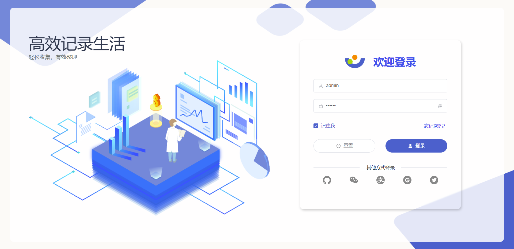
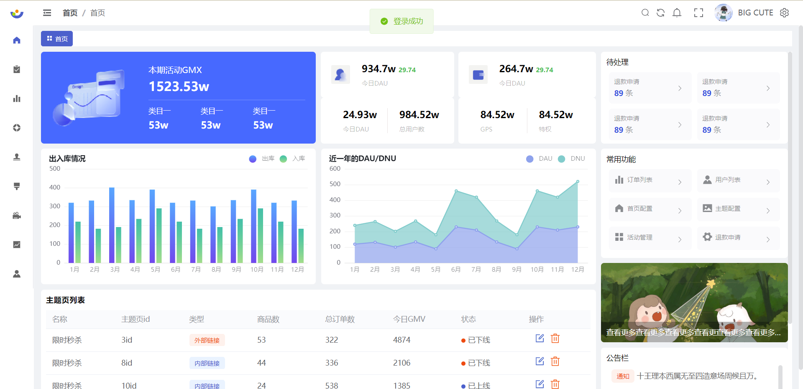
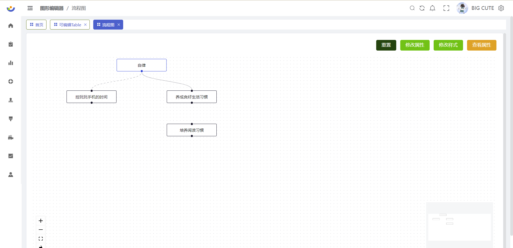

#💐💐💐 Vue 3.2 + vuex + Vite2 + Element-Plus 后台管理系统



### 前言 📖

项目基于 Vue3.2、Javascript、Vite2、vuex、Element-Plus 开发的一套后台管理模板，目前利用空余时间开发 🕒🕒🕒🕒。项目中借鉴很多优秀的后台管理系统，从 0 开始搭建项目（其中 ui 图是借鉴了【即时设计】里的优秀的设计图），整个项目还有很多地方不完善，后期会持续更新，希望大家能多提意见。

### ？为什么开发这个管理系统 👩‍🔬

- 主要是想把自己常用的组件进行一个封装 二次巩固
- 目前看了很多优秀的 Vue3 的开源后台管理系统，感觉都非常庞大（想开发一套适合自己的）

### 一、在线预览 🛫

- Link：http://124.221.156.158:9797/#/login

### 二、gitee 地址 🛫

- Link：https://gitee.com/tanzo/vue-manage-system

### 三、本地预览 🛫🛫🛫

```
git clone 项目地址

npm install  (依赖安装失败可以尝试cnpm install)

npm run dev
```

### 四、🔨 项目功能

- 🚀 使用 Vue3.2 开发，单文件组件 `＜script setup＞`开发
- 🚀 采用动态路由菜单模式
- 🚀 数据模拟用到了 MockJS
- 🚀 使用 Vuex getter 模块化管理（ 加入了持久化插件）
- 🚀 Axios 的二次封装 （全局错误拦截、常用请求封装、全局请求 Loading、取消重复请求……）
- 🚀 对 el-table 组件进行的二次封装
- 🚀 使用 vue-router 进行路由权限拦截（403 页面）、页面按钮权限配置、路由懒加载
- 🚀 使用 keep-alive 对整个页面进行缓存，支持多级嵌套页面（缓存路由里可配置、页面切换加入动画效果）
- 🚀 常用自定义指令的封装 直接 v-copy 即可实现复制 （复制、拖拽、、、等等）
- 🚀 vite.config.js 打包配置(静态资源合并打包/清除 log/gzip 压缩配置等)

### 五、项目截图 📷

#### 1、登录页：


#### 2、首页：



#### 3、表格页：


#### 4、流程图：



### 六、文件资源目录 📚

```text
├─ .vscode                # vscode推荐配置
├─ public                 # 静态资源文件（忽略打包）
├─ src
│  ├─ api                 # API 接口管理
│  ├─ assets              # 静态资源文件
│  ├─ components          # 全局组件
│  ├─ config              # 全局配置项
│  ├─ instruction         # 指令文件
│  ├─ layout              # 框架布局
│  ├─ router              # 路由管理
│  ├─ store               # VUEX模块化管理
│  ├─ styles              # 全局样式
│  ├─ utils               # 工具库（color函数的封装）
│  ├─ views               # 项目所有页面
│  ├─ App.vue             # 入口页面
│  └─ main.js             # 入口文件
└─ vite.config.ts         # vite 配置
```

### 七、浏览器支持

> vue3.2 不支持 IE 浏览器。其他还行吧（其实我没测 🤣🧐）

### 八、项目后台接口 🧩🧐

> 项目后台接口全部采用 Mock 数据

### 九 最后求个关注 👀 🌟🌟🌟🙇‍♀️🙇‍♀️🙇‍♀️


